# K8s + Terraform Portfolio Demo


Projekt demonstracyjny pokazujący znajomość Kubernetes i Terraform w środowisku lokalnym. Aplikacja uruchamiana jest za pomocą minikube i zarządzana przez Terraform, co pozwala na naukę i demonstrację umiejętności DevOps bez kosztów chmury publicznej.

## 📋 Spis treści

- [Przegląd projektu](#-przegląd-projektu)
- [Architektura](#-architektura)
- [Wymagania](#-wymagania)
- [Instalacja](#-instalacja)
- [Uruchomienie](#-uruchomienie)
- [Testowanie](#-testowanie)
- [Screenshoty](#-screenshoty)
- [Struktura projektu](#-struktura-projektu)
- [Technologie](#-technologie)
- [Funkcjonalności](#-funkcjonalności)
- [Troubleshooting](#-troubleshooting)
- [Czyszczenie](#-czyszczenie)

## 🎯 Przegląd projektu

Ten projekt demonstruje praktyczne zastosowanie Kubernetes i Terraform w środowisku lokalnym. Zawiera:

- **Aplikację Flask** z interfejsem web i API endpoints
- **Manifesty Kubernetes** (Deployment, Service, ConfigMap, Secret, Ingress, HPA)
- **Konfigurację Terraform** do zarządzania zasobami Kubernetes
- **Skrypty automatyzacji** do łatwego wdrażania i zarządzania
- **Kompletną dokumentację** z instrukcjami i miejscami na screenshoty

### Główne cele projektu:
- Demonstracja znajomości Kubernetes i Terraform
- Pokazanie best practices w konteneryzacji aplikacji
- Prezentacja umiejętności automatyzacji DevOps
- Stworzenie portfolio bez kosztów chmury publicznej

## 🏗️ Architektura

### Komponenty systemu:

```
┌─────────────────┐    ┌─────────────────┐    ┌─────────────────┐
│   Terraform     │    │   Kubernetes    │    │   Application   │
│                 │    │                 │    │                 │
│ • Provider      │───▶│ • Namespace     │───▶│ • Flask API     │
│ • Variables     │    │ • Deployment    │    │ • Web Interface │
│ • Resources     │    │ • Services      │    │ • Health Checks │
│ • Outputs       │    │ • ConfigMap     │    │ • Mock Data     │
│                 │    │ • Secret        │    │                 │
│                 │    │ • Ingress       │    │                 │
│                 │    │ • HPA           │    │                 │
└─────────────────┘    └─────────────────┘    └─────────────────┘
```

### Przepływ wdrażania:

1. **Setup** - Konfiguracja minikube i budowanie obrazu Docker
2. **Terraform Init** - Inicjalizacja providerów i modułów
3. **Terraform Plan** - Planowanie zmian w infrastrukturze
4. **Terraform Apply** - Wdrażanie zasobów Kubernetes
5. **Verification** - Testowanie i weryfikacja działania

## 📋 Wymagania

### Wymagane oprogramowanie:

- **Docker** (20.10+) - do konteneryzacji aplikacji
- **minikube** (1.25+) - lokalny klaster Kubernetes
- **kubectl** (1.24+) - narzędzie CLI do Kubernetes
- **Terraform** (1.0+) - do zarządzania infrastrukturą
- **curl** - do testowania API endpoints
- **jq** (opcjonalnie) - do formatowania JSON w testach

### Wymagania systemowe:

- **RAM**: minimum 4GB (zalecane 8GB)
- **CPU**: minimum 2 rdzenie
- **Dysk**: minimum 10GB wolnego miejsca
- **System**: Linux, macOS lub Windows z WSL2

### Sprawdzenie wymagań:

```bash
# Sprawdź wersje zainstalowanego oprogramowania
docker --version
minikube version
kubectl version --client
terraform version
```

<!-- SCREENSHOT PLACEHOLDER: Version Check -->
*Miejsce na screenshot sprawdzenia wersji*

## 🚀 Instalacja

### 1. Klonowanie repozytorium

```bash
git clone <repository-url>
cd k8s-terraform-portfolio
```

### 2. Automatyczna instalacja

Użyj skryptu setup do automatycznej konfiguracji środowiska:

```bash
# Nadaj uprawnienia wykonywania
chmod +x scripts/*.sh

# Uruchom setup
./scripts/setup.sh
```

Skrypt setup automatycznie:
- Sprawdzi wymagania systemowe
- Uruchomi minikube z odpowiednimi parametrami
- Włączy wymagane addons (ingress, metrics-server)
- Zbuduje obraz Docker aplikacji
- Załaduje obraz do minikube
- Zainicjalizuje Terraform

<!-- SCREENSHOT PLACEHOLDER: Setup Script Output -->
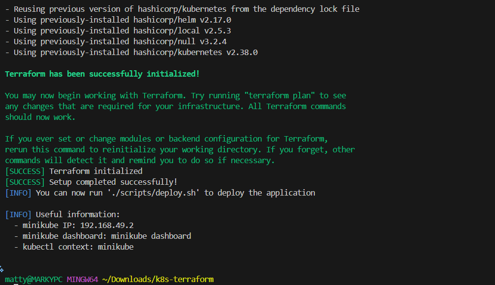

### 3. Alternatywna instalacja manualna

Jeśli wolisz wykonać kroki manualnie:

```bash
# 1. Uruchom minikube
minikube start --driver=docker --cpus=2 --memory=4096

# 2. Włącz addons
minikube addons enable ingress
minikube addons enable metrics-server

# 3. Ustaw kontekst kubectl
kubectl config use-context minikube

# 4. Zbuduj obraz Docker
docker build -t portfolio-demo:latest -f docker/Dockerfile .

# 5. Załaduj obraz do minikube
minikube image load portfolio-demo:latest

# 6. Zainicjalizuj Terraform
cd terraform
terraform init
cd ..
```

### 4. Weryfikacja instalacji

```bash
# Sprawdź status minikube
minikube status

# Sprawdź dostępne nodes
kubectl get nodes

# Sprawdź obrazy w minikube
minikube image ls | grep portfolio-demo
```

<!-- SCREENSHOT PLACEHOLDER: Installation Verification -->
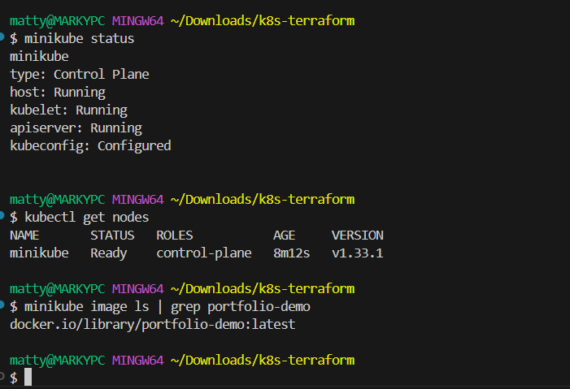


## ▶️ Uruchomienie

### Metoda 1: Użycie skryptu deploy (zalecane)

```bash
# Wdrożenie aplikacji
./scripts/deploy.sh
```

Skrypt automatycznie:
- Wykona `terraform plan`
- Poprosi o potwierdzenie
- Zastosuje konfigurację Terraform
- Poczeka na gotowość deployment
- Wyświetli informacje o dostępie

<!-- SCREENSHOT PLACEHOLDER: Deploy Script Output -->
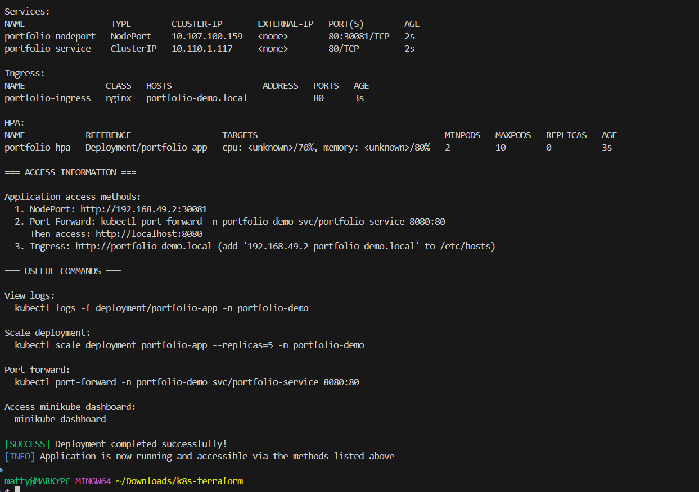

### Metoda 2: Użycie Makefile

```bash
# Wyświetl dostępne komendy
make help

# Wdrożenie aplikacji
make deploy

# Sprawdzenie statusu
make status
```

### Metoda 3: Manualne wdrożenie Terraform

```bash
cd terraform

# Planowanie zmian
terraform plan -out=tfplan

# Zastosowanie zmian
terraform apply tfplan

# Sprawdzenie stanu
terraform show
```

### Dostęp do aplikacji

Po wdrożeniu aplikacja będzie dostępna na kilka sposobów:

#### 1. NodePort (najłatwiejszy)
```bash
# Pobierz IP minikube i port
minikube ip
kubectl get service portfolio-nodeport -n portfolio-demo

# Otwórz w przeglądarce
# http://<MINIKUBE_IP>:30080
```

#### 2. Port Forward
```bash
# Przekierowanie portu
kubectl port-forward -n portfolio-demo svc/portfolio-service 8080:80

# Dostęp przez localhost
# http://localhost:8080
```

#### 3. Ingress (wymaga konfiguracji hosts)
```bash
# Dodaj do /etc/hosts
echo "$(minikube ip) portfolio-demo.local" | sudo tee -a /etc/hosts

# Dostęp przez domenę
# http://portfolio-demo.local
```

<!-- SCREENSHOT PLACEHOLDER: Application Homepage -->
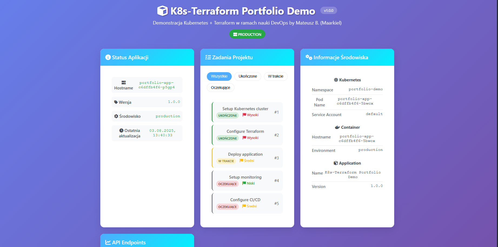

## 🧪 Testowanie

### Automatyczne testowanie

```bash
# Uruchom pełny zestaw testów
./scripts/test.sh
```

Test sprawdza:
- Status podów i serwisów
- Dostępność wszystkich API endpoints
- Funkcjonalność skalowania
- Integrację ConfigMap i Secret
- Działanie health checks

<!-- SCREENSHOT PLACEHOLDER: Test Script Output -->
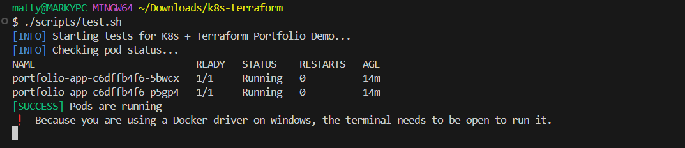

### Manualne testowanie API

```bash
# Pobierz URL aplikacji
MINIKUBE_IP=$(minikube ip)
NODEPORT=$(kubectl get service portfolio-nodeport -n portfolio-demo -o jsonpath='{.spec.ports[0].nodePort}')
BASE_URL="http://${MINIKUBE_IP}:${NODEPORT}"

# Test health check
curl -s "${BASE_URL}/health" | jq .

# Test status API
curl -s "${BASE_URL}/api/status" | jq .

# Test tasks API
curl -s "${BASE_URL}/api/tasks" | jq .

# Test environment info
curl -s "${BASE_URL}/api/info" | jq .
```

### Testowanie skalowania

```bash
# Skalowanie do 5 replik
kubectl scale deployment portfolio-app --replicas=5 -n portfolio-demo

# Sprawdzenie statusu
kubectl get pods -n portfolio-demo

# Skalowanie z użyciem Makefile
make scale REPLICAS=3
```

<!-- SCREENSHOT PLACEHOLDER: Scaling Test -->
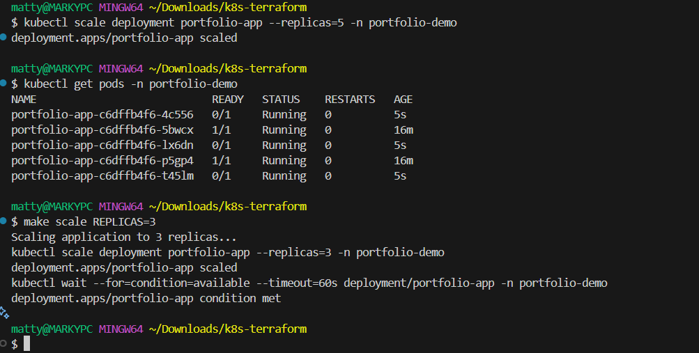

### Testowanie HPA (Horizontal Pod Autoscaler)

```bash
# Sprawdź status HPA
kubectl get hpa -n portfolio-demo

# Generowanie obciążenia (w osobnym terminalu)
kubectl run -i --tty load-generator --rm --image=busybox --restart=Never -- /bin/sh
# W kontenerze:
while true; do wget -q -O- http://portfolio-service.portfolio-demo.svc.cluster.local; done
```

<!-- SCREENSHOT PLACEHOLDER: HPA in Action -->
*Miejsce na screenshot działania HPA*


## 📸 Screenshoty

### Dashboard Kubernetes

<!-- SCREENSHOT PLACEHOLDER: Minikube Dashboard Overview -->
*Miejsce na screenshot głównego widoku minikube dashboard*

```bash
# Otwórz dashboard
minikube dashboard
```

<!-- SCREENSHOT PLACEHOLDER: Pods View -->
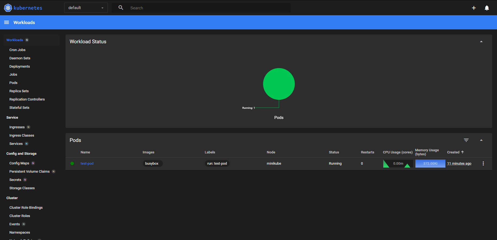

<!-- SCREENSHOT PLACEHOLDER: Services View -->
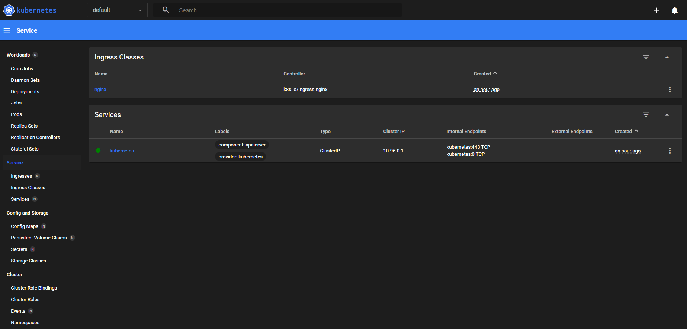

### Aplikacja Web

<!-- SCREENSHOT PLACEHOLDER: Application Main Page -->
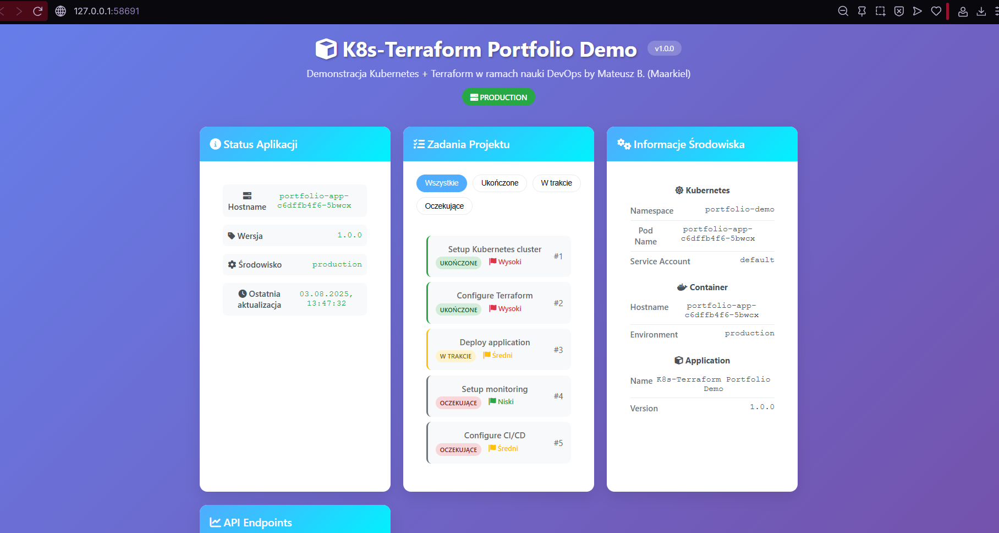

<!-- SCREENSHOT PLACEHOLDER: API Status Card -->
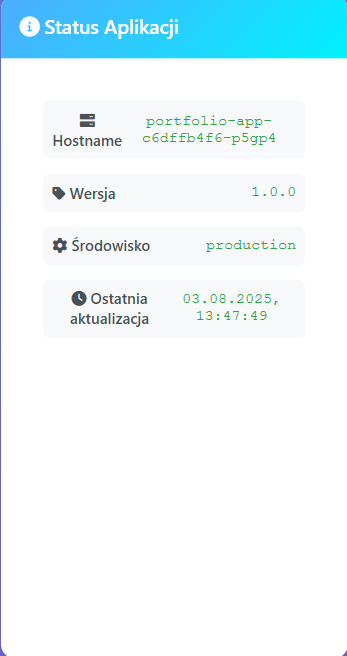

<!-- SCREENSHOT PLACEHOLDER: Tasks Management -->
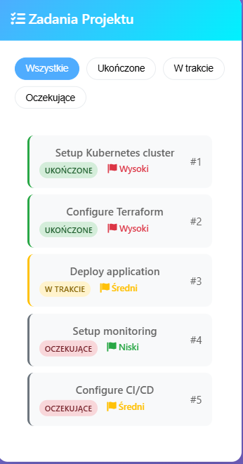

<!-- SCREENSHOT PLACEHOLDER: Environment Info -->
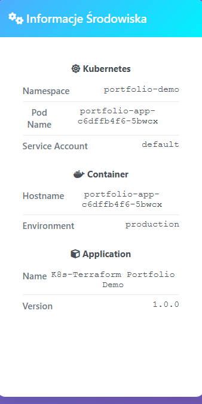

### Terraform

<!-- SCREENSHOT PLACEHOLDER: Terraform Plan -->
*Miejsce na screenshot wyjścia terraform plan*

<!-- SCREENSHOT PLACEHOLDER: Terraform Apply -->
*Miejsce na screenshot wyjścia terraform apply*

<!-- SCREENSHOT PLACEHOLDER: Terraform State -->
*Miejsce na screenshot stanu Terraform*

### Kubectl Commands

<!-- SCREENSHOT PLACEHOLDER: kubectl get all -->
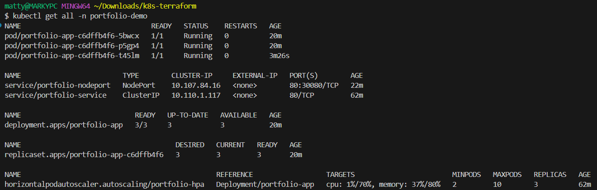

<!-- SCREENSHOT PLACEHOLDER: kubectl describe deployment -->
*Miejsce na screenshot kubectl describe deployment*

<!-- SCREENSHOT PLACEHOLDER: kubectl logs -->
*Miejsce na screenshot logów aplikacji*

### Monitoring i Skalowanie

<!-- SCREENSHOT PLACEHOLDER: HPA Status -->
*Miejsce na screenshot statusu HPA*

<!-- SCREENSHOT PLACEHOLDER: Resource Usage -->
*Miejsce na screenshot użycia zasobów*

<!-- SCREENSHOT PLACEHOLDER: Scaling in Progress -->
*Miejsce na screenshot procesu skalowania*

## 📁 Struktura projektu

```
k8s-terraform-portfolio/
├── app/                          # Kod aplikacji Flask
│   ├── app.py                   # Główna aplikacja Flask
│   ├── requirements.txt         # Zależności Python
│   ├── templates/               # Szablony HTML
│   │   └── index.html          # Główna strona
│   └── static/                  # Pliki statyczne
│       ├── css/
│       │   └── style.css       # Style CSS
│       └── js/
│           └── app.js          # JavaScript
├── docker/                      # Konfiguracja Docker
│   └── Dockerfile              # Definicja obrazu Docker
├── k8s/                         # Manifesty Kubernetes
│   ├── namespace.yaml          # Namespace
│   ├── configmap.yaml          # ConfigMap
│   ├── secret.yaml             # Secret
│   ├── deployment.yaml         # Deployment
│   ├── service.yaml            # Services (ClusterIP + NodePort)
│   ├── ingress.yaml            # Ingress
│   ├── hpa.yaml                # HorizontalPodAutoscaler
│   └── kustomization.yaml      # Kustomize config
├── terraform/                   # Konfiguracja Terraform
│   ├── versions.tf             # Wersje providerów
│   ├── providers.tf            # Konfiguracja providerów
│   ├── variables.tf            # Definicje zmiennych
│   ├── main.tf                 # Główne zasoby
│   ├── outputs.tf              # Definicje outputów
│   └── terraform.tfvars        # Wartości zmiennych
├── scripts/                     # Skrypty automatyzacji
│   ├── setup.sh               # Setup środowiska
│   ├── deploy.sh              # Wdrożenie aplikacji
│   ├── test.sh                # Testowanie aplikacji
│   └── cleanup.sh             # Czyszczenie zasobów
├── Makefile                     # Uproszczone komendy
├── docker-compose.yml          # Alternatywne uruchomienie
└── README.md                   # Ta dokumentacja
```

### Opis głównych komponentów:

#### Aplikacja Flask (`app/`)
- **app.py**: Główna aplikacja z API endpoints i logiką biznesową
- **templates/**: Szablony HTML z responsywnym interfejsem
- **static/**: CSS i JavaScript dla interaktywności

#### Kubernetes (`k8s/`)
- **Deployment**: 3 repliki aplikacji z health checks
- **Services**: ClusterIP dla komunikacji wewnętrznej + NodePort dla dostępu zewnętrznego
- **ConfigMap/Secret**: Konfiguracja aplikacji i dane wrażliwe
- **Ingress**: Routing HTTP z nginx-ingress
- **HPA**: Automatyczne skalowanie na podstawie CPU/Memory

#### Terraform (`terraform/`)
- **Providers**: Kubernetes, Helm, Local, Null
- **Variables**: Parametryzacja wszystkich aspektów wdrożenia
- **Resources**: Wszystkie zasoby Kubernetes zarządzane jako kod
- **Outputs**: Informacje o wdrożonych zasobach i sposobach dostępu


## 🛠️ Technologie

### Backend
- **Flask 2.3.3** - Framework web aplikacji
- **Flask-CORS** - Obsługa Cross-Origin Resource Sharing
- **Gunicorn** - WSGI HTTP Server dla produkcji

### Frontend
- **HTML5/CSS3** - Struktura i stylowanie
- **JavaScript (ES6+)** - Interaktywność i komunikacja z API
- **Font Awesome** - Ikony
- **Responsive Design** - Wsparcie dla urządzeń mobilnych

### Konteneryzacja
- **Docker** - Konteneryzacja aplikacji
- **Multi-stage build** - Optymalizacja rozmiaru obrazu
- **Non-root user** - Bezpieczeństwo kontenerów

### Kubernetes
- **minikube** - Lokalny klaster Kubernetes
- **kubectl** - Narzędzie CLI do zarządzania
- **nginx-ingress** - Ingress controller
- **metrics-server** - Metryki dla HPA

### Infrastructure as Code
- **Terraform** - Zarządzanie infrastrukturą jako kod
- **Kubernetes Provider** - Integracja z Kubernetes API
- **HCL** - HashiCorp Configuration Language

### Automatyzacja
- **Bash Scripts** - Skrypty automatyzacji
- **Makefile** - Uproszczone komendy
- **CI/CD Ready** - Gotowe do integracji z pipeline

## ⚡ Funkcjonalności

### Aplikacja Web

#### 🏠 Strona główna
- **Responsywny interfejs** - Działa na desktop i mobile
- **Real-time status** - Aktualizacja statusu co 30 sekund
- **Interaktywne karty** - Animacje i hover effects
- **Filtry zadań** - Filtrowanie według statusu

#### 🔌 API Endpoints

| Endpoint | Metoda | Opis |
|----------|--------|------|
| `/` | GET | Strona główna aplikacji |
| `/health` | GET | Health check dla Kubernetes |
| `/api/status` | GET | Status aplikacji i środowiska |
| `/api/tasks` | GET | Lista zadań z filtrowaniem |
| `/api/tasks/{id}` | GET | Szczegóły konkretnego zadania |
| `/api/info` | GET | Informacje o środowisku K8s |

#### 📊 Funkcje demonstracyjne
- **Mock data** - Przykładowe zadania projektu
- **Environment info** - Wyświetlanie zmiennych Kubernetes
- **Health monitoring** - Endpoint dla health checks
- **Error handling** - Obsługa błędów API

### Kubernetes Features

#### 🚀 Deployment
- **3 repliki** domyślnie (konfigurowalne)
- **Rolling updates** - Bezpieczne aktualizacje
- **Resource limits** - Ograniczenia CPU/Memory
- **Security context** - Non-root user, dropped capabilities

#### 🔄 Auto-scaling
- **HPA (Horizontal Pod Autoscaler)** - Automatyczne skalowanie
- **CPU threshold**: 70% (konfigurowalne)
- **Memory threshold**: 80% (konfigurowalne)
- **Min/Max replicas**: 2-10 (konfigurowalne)

#### 🌐 Networking
- **ClusterIP Service** - Komunikacja wewnętrzna
- **NodePort Service** - Dostęp zewnętrzny
- **Ingress** - HTTP routing z nginx
- **Service Discovery** - Automatyczne wykrywanie serwisów

#### 🔧 Configuration Management
- **ConfigMap** - Konfiguracja aplikacji
- **Secret** - Dane wrażliwe (base64 encoded)
- **Environment variables** - Integracja z Kubernetes API
- **Volume mounts** - Gotowe do montowania plików

#### 🏥 Health & Monitoring
- **Liveness Probe** - Sprawdzanie żywotności
- **Readiness Probe** - Sprawdzanie gotowości
- **Resource monitoring** - Metryki CPU/Memory
- **Logs aggregation** - Centralne logowanie

### Terraform Features

#### 📋 Infrastructure as Code
- **Declarative configuration** - Opis pożądanego stanu
- **State management** - Śledzenie stanu infrastruktury
- **Plan/Apply workflow** - Bezpieczne zmiany
- **Resource dependencies** - Automatyczne zarządzanie zależnościami

#### 🔧 Parametryzacja
- **Variables** - Wszystkie aspekty konfigurowalne
- **Validation** - Walidacja wartości zmiennych
- **Defaults** - Sensowne wartości domyślne
- **Outputs** - Informacje o wdrożonych zasobach

#### 🔄 Lifecycle Management
- **Create** - Tworzenie nowych zasobów
- **Update** - Aktualizacja istniejących zasobów
- **Delete** - Usuwanie zasobów
- **Import** - Import istniejących zasobów

### DevOps Features

#### 🤖 Automatyzacja
- **Setup script** - Automatyczna konfiguracja środowiska
- **Deploy script** - Automatyczne wdrażanie
- **Test script** - Automatyczne testowanie
- **Cleanup script** - Automatyczne czyszczenie

#### 📊 Monitoring & Testing
- **Health checks** - Sprawdzanie stanu aplikacji
- **API testing** - Testowanie wszystkich endpoints
- **Scaling tests** - Testowanie skalowania
- **Integration tests** - Testowanie integracji K8s

#### 🛠️ Development Tools
- **Makefile** - Uproszczone komendy
- **Docker Compose** - Alternatywne uruchomienie lokalne
- **Port forwarding** - Łatwy dostęp do aplikacji
- **Log viewing** - Podgląd logów aplikacji


## 🔧 Troubleshooting

### Częste problemy i rozwiązania

#### Problem: minikube nie startuje
```bash
# Sprawdź status Docker
docker info

# Restart minikube z większymi zasobami
minikube delete
minikube start --driver=docker --cpus=4 --memory=8192

# Sprawdź logi minikube
minikube logs
```

#### Problem: Obraz Docker nie jest dostępny w minikube
```bash
# Sprawdź obrazy w minikube
minikube image ls | grep portfolio-demo

# Przebuduj i załaduj obraz
docker build -t portfolio-demo:latest -f docker/Dockerfile .
minikube image load portfolio-demo:latest

# Sprawdź ponownie
minikube image ls | grep portfolio-demo
```

#### Problem: Pody są w stanie Pending
```bash
# Sprawdź events
kubectl get events -n portfolio-demo --sort-by='.lastTimestamp'

# Sprawdź resources
kubectl describe pod <pod-name> -n portfolio-demo

# Sprawdź node resources
kubectl describe nodes
```

#### Problem: Aplikacja nie odpowiada
```bash
# Sprawdź status podów
kubectl get pods -n portfolio-demo

# Sprawdź logi aplikacji
kubectl logs -f deployment/portfolio-app -n portfolio-demo

# Sprawdź health check
kubectl exec -n portfolio-demo <pod-name> -- curl localhost:5000/health
```

#### Problem: Terraform apply fails
```bash
# Sprawdź konfigurację kubectl
kubectl config current-context

# Sprawdź dostępność API server
kubectl cluster-info

# Reinicjalizuj Terraform
cd terraform
rm -rf .terraform
terraform init
```

#### Problem: Ingress nie działa
```bash
# Sprawdź czy ingress addon jest włączony
minikube addons list | grep ingress

# Włącz ingress addon
minikube addons enable ingress

# Sprawdź ingress controller
kubectl get pods -n ingress-nginx
```

#### Problem: HPA nie skaluje
```bash
# Sprawdź czy metrics-server działa
kubectl get pods -n kube-system | grep metrics-server

# Włącz metrics-server
minikube addons enable metrics-server

# Sprawdź metryki
kubectl top pods -n portfolio-demo
kubectl top nodes
```

### Przydatne komendy diagnostyczne

```bash
# Sprawdzenie ogólnego stanu
make status

# Szczegółowe informacje o zasobach
make describe

# Logi aplikacji
make logs

# Test wszystkich funkcjonalności
./scripts/test.sh

# Sprawdzenie konfiguracji Terraform
cd terraform && terraform validate

# Sprawdzenie planowanych zmian
cd terraform && terraform plan
```

### Resetowanie środowiska

Jeśli nic nie pomaga, możesz zresetować całe środowisko:

```bash
# Wyczyść wszystkie zasoby
./scripts/cleanup.sh

# Usuń minikube cluster
minikube delete

# Uruchom setup od nowa
./scripts/setup.sh
```

## 🧹 Czyszczenie

### Automatyczne czyszczenie (zalecane)

```bash
# Usuń wszystkie zasoby projektu
./scripts/cleanup.sh
```

Skrypt automatycznie:
- Usuwa zasoby Terraform
- Usuwa namespace Kubernetes
- Usuwa obrazy Docker
- Wyświetla opcje dalszego czyszczenia

### Manualne czyszczenie

#### 1. Usunięcie zasobów Terraform
```bash
cd terraform
terraform destroy -auto-approve
```

#### 2. Usunięcie namespace Kubernetes
```bash
kubectl delete namespace portfolio-demo --ignore-not-found=true
```

#### 3. Usunięcie obrazów Docker
```bash
# Usuń obraz lokalnie
docker rmi portfolio-demo:latest

# Usuń obraz z minikube
minikube image rm portfolio-demo:latest
```

#### 4. Zatrzymanie minikube (opcjonalnie)
```bash
# Zatrzymaj minikube
minikube stop

# Lub usuń całkowicie
minikube delete
```

### Czyszczenie z użyciem Makefile

```bash
# Wyczyść zasoby projektu
make cleanup

# Sprawdź status po czyszczeniu
make status
```

### Weryfikacja czyszczenia

```bash
# Sprawdź czy namespace został usunięty
kubectl get namespaces | grep portfolio-demo

# Sprawdź czy obrazy zostały usunięte
docker images | grep portfolio-demo
minikube image ls | grep portfolio-demo

# Sprawdź stan Terraform
cd terraform && terraform show
```

---

### Umiejętności demonstrowane w projekcie:

#### Kubernetes
- ✅ Tworzenie i zarządzanie manifestami YAML
- ✅ Deployment strategies (Rolling Updates)
- ✅ Service Discovery i Networking
- ✅ ConfigMaps i Secrets
- ✅ Ingress i Load Balancing
- ✅ Horizontal Pod Autoscaling
- ✅ Resource Management i Limits
- ✅ Health Checks i Monitoring
- ✅ Security Contexts

#### Terraform
- ✅ Infrastructure as Code
- ✅ Provider configuration
- ✅ Resource management
- ✅ Variables i Outputs
- ✅ State management
- ✅ Plan/Apply workflow
- ✅ Resource dependencies

#### DevOps
- ✅ Konteneryzacja z Docker
- ✅ Multi-stage builds
- ✅ Automatyzacja z bash scripts
- ✅ CI/CD readiness
- ✅ Monitoring i logging
- ✅ Testing strategies

#### Development
- ✅ RESTful API design
- ✅ Responsive web design
- ✅ Error handling
- ✅ Security best practices
- ✅ Documentation

### Możliwe rozszerzenia:
- Integracja z CI/CD (GitHub Actions, GitLab CI)
- Monitoring z Prometheus/Grafana
- Centralne logowanie z ELK Stack
- Service Mesh z Istio
- GitOps z ArgoCD
- Backup i disaster recovery

---

**Autor**: Marky B 
**Data**: Sierpień 2025  
**Licencja**: MIT  

*Ten projekt został stworzony w celach edukacyjnych i demonstracyjnych dla portfolio DevOps.*

